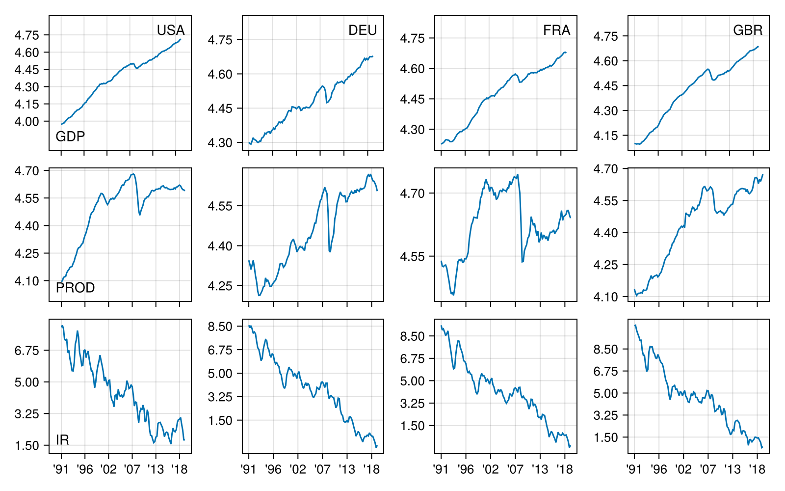
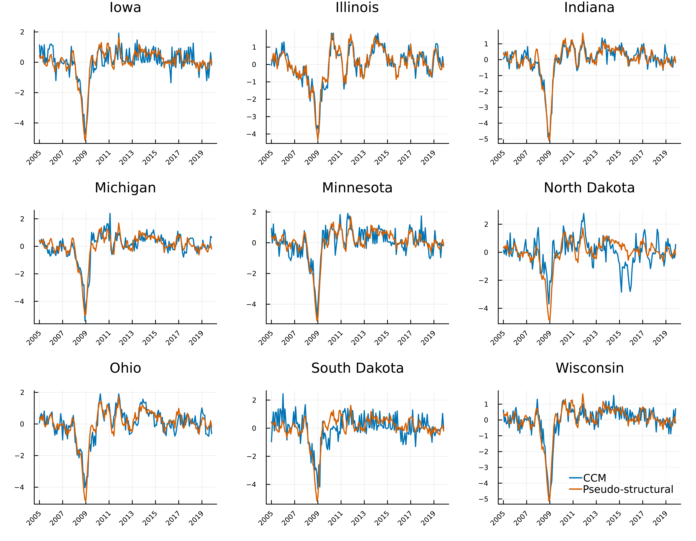

## Publications

::::: {.pub}
:::{.column-margin}
{height=175}
:::

[Detecting Cointegrating Relations in Matrix-Valued Time Series](https://www.sciencedirect.com/science/article/pii/S0165176525000424){.pub-title}

[Alain Hecq, Ivan Ricardo, Ines Wilms]{.pub-authors}\
[*Economics Letters* (2025) · [Slides](assets/matrixcointegration.html)]{.pub-venue}

::: {.callout-tip title="Abstract" collapse=true}
This paper proposes a Matrix Error Correction Model to identify cointegration relations in matrix-valued time series. We hereby allow separate cointegrating relations along the rows and columns of the matrix-valued time series and use information criteria to select the cointegration ranks. Through Monte Carlo simulations and a macroeconomic application, we demonstrate that our approach provides a reliable estimation of the number of cointegrating relationships.
:::
:::::

::::: {.pub}
:::{.column-margin}
{height=220}
:::

[Decomposing Co-Movements in Matrix-Valued Time Series: A Pseudo-Structural Reduced Rank Approach](https://www.sciencedirect.com/science/article/pii/S2452306226000328?via%3Dihub){.pub-title}

[Alain Hecq, Ivan Ricardo, Ines Wilms]{.pub-authors}\
[*Econometrics and Statistics* (2026)]{.pub-venue}

::: {.callout-tip title="Abstract" collapse=true}
A pseudo-structural framework is proposed for analyzing contemporaneous co-movements in stationary reduced-rank matrix autoregressive (RRMAR) models. Unlike conventional vector-autoregressive (VAR) models that would discard the matrix structure, the formulation preserves it, enabling a decomposition of co-movements into three interpretable components: row-specific, column-specific, and joint (row–column) interactions across the matrix-valued time series. The estimator admits standard asymptotic inference and a BIC-type criterion is proposed for the joint selection of the reduced ranks and the autoregressive lag order. The method’s finite-sample performance in terms of estimation accuracy, coverage and rank selection is validated through simulation experiments, including cases of rank misspecification. Practical usefulness is illustrated through the application of the pseudo-structural approach to distill coincident indicators from raw labor market data across nine Midwestern U.S. states, uncovering distinct row-, column-, and joint co-movement patterns that reflect both within-state labor market dynamics and cross-state linkages.
:::
:::::

## Working Papers

::::: {.pub}
[Reduced-Rank Matrix Autoregressions: A Medium $N$ Approach](https://arxiv.org/abs/2407.07973){.pub-title}

[Alain Hecq, Ivan Ricardo, Ines Wilms]{.pub-authors}\
[arXiv:2407.07973 · [Slides](assets/matrixsccfslides.html)]{.pub-venue}

::: {.callout-tip title="Abstract" collapse=true}
[abstract unchanged]
:::
:::::

## Works in Progress

- Impulse Response Inference for Matrix-Valued Time Series
